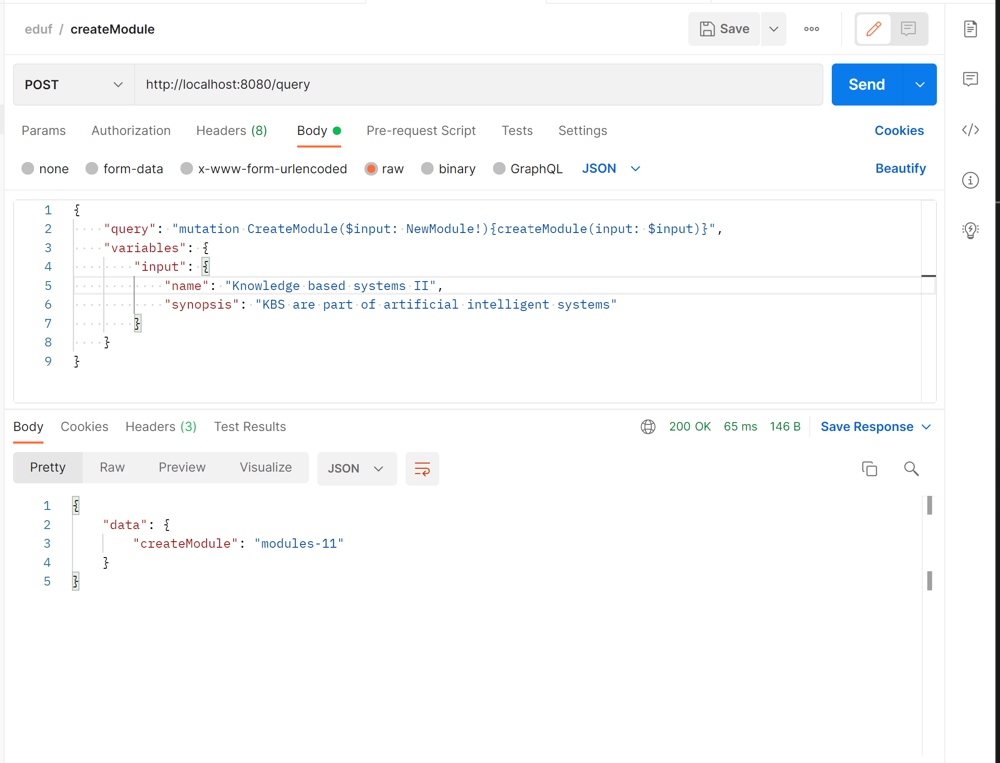
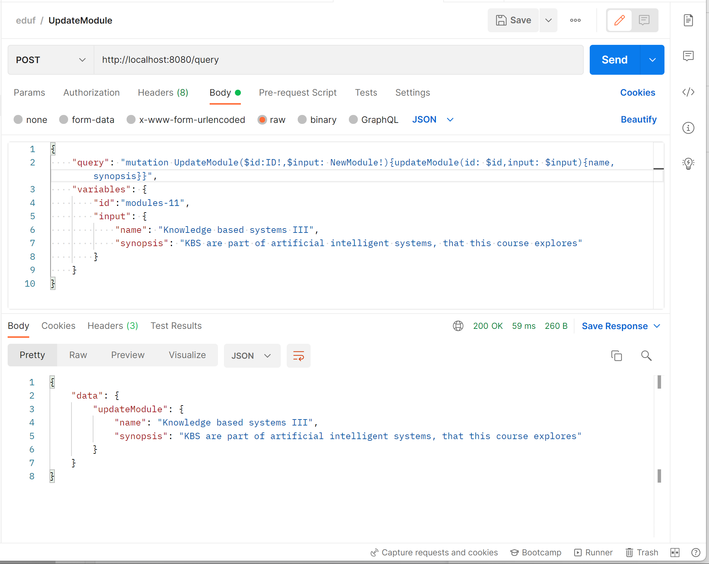
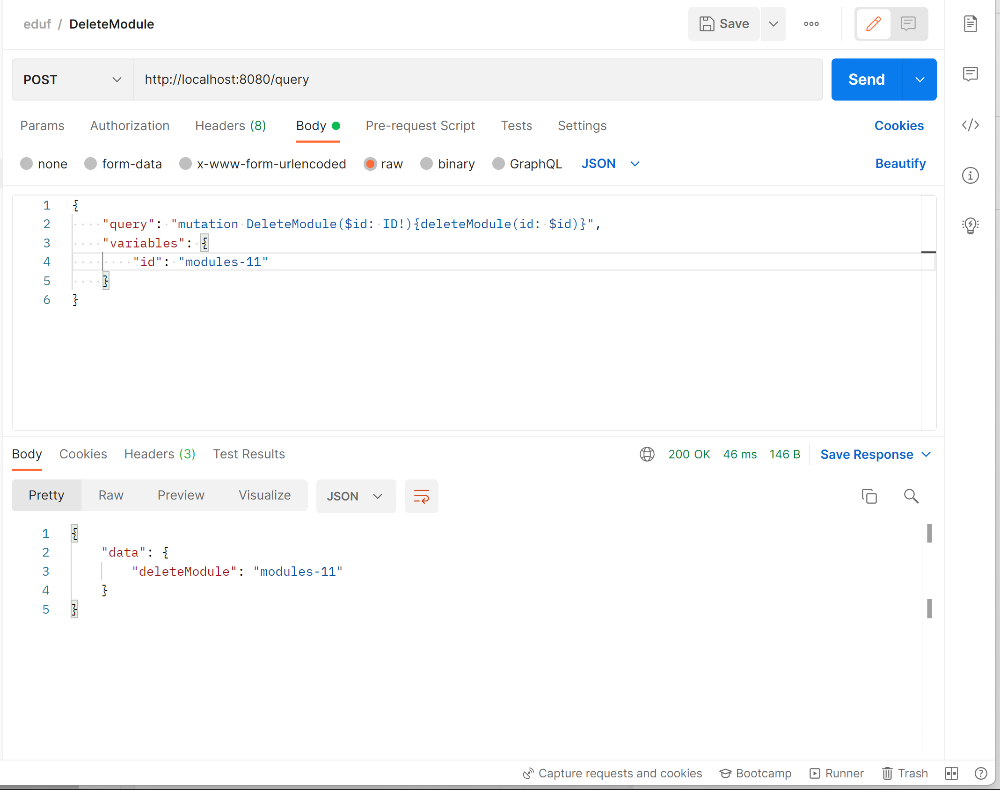
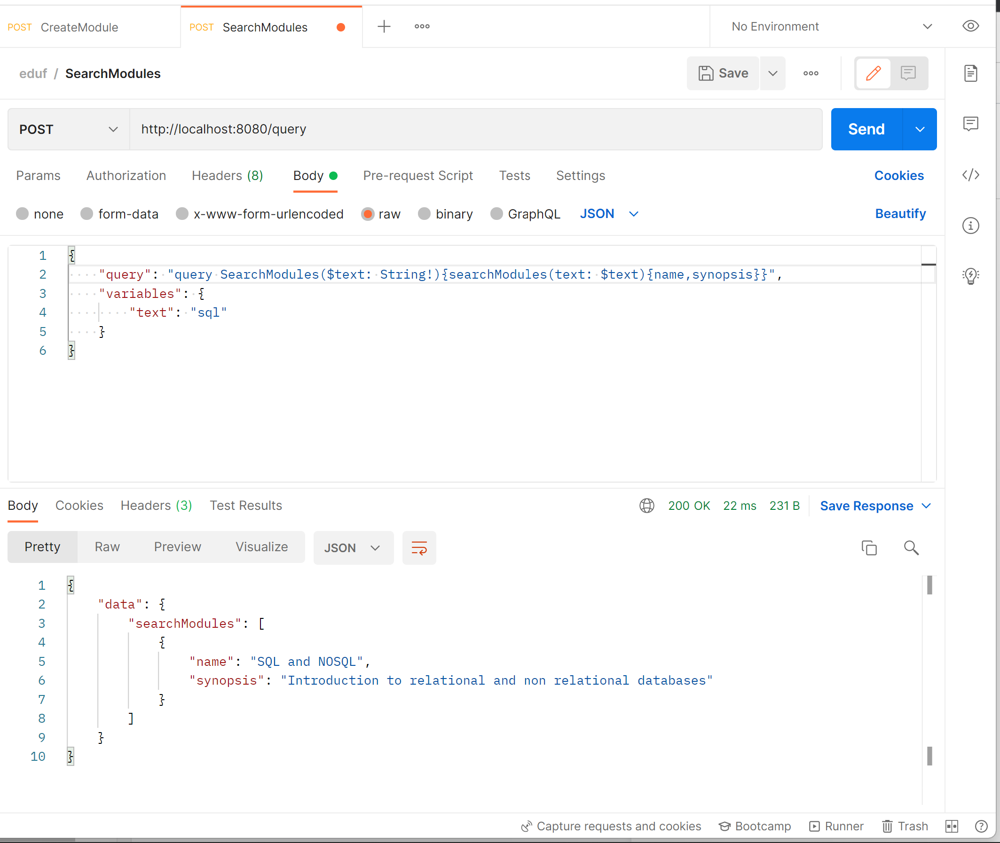
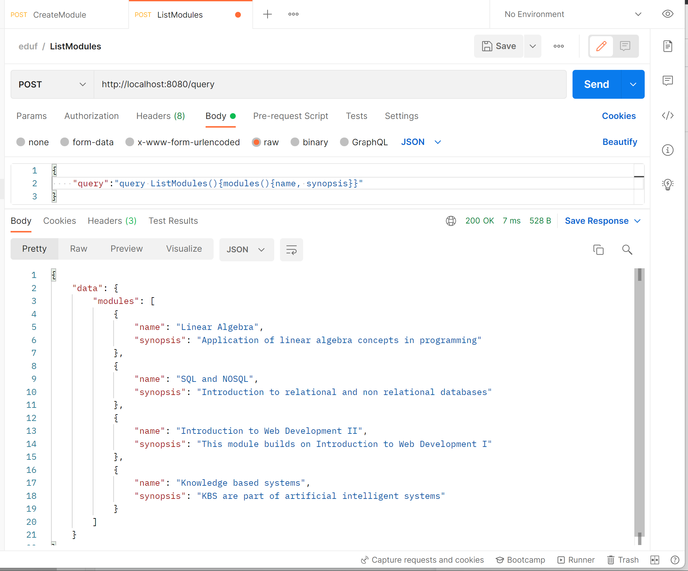

# Microservice

This service is build using Golang and the database used is Postgres. The service can be used with any other SQL database by changing the database connection in the  file

## Setup

Install a postgres database and create the database 'edufi' and the tables. The guideline for performing those operations can be found at sql folder, that is provided with this folder.

Make sure you have installed [http://golang.org/](http://golang.org/)

Open your terminal and change directory to the root folder of this file.

Run `go mod tidy` to install the required packages
Then run `go install` to build and generate the binary file
Run `server.exe` to run the program

## Queries

You can query through a gui app that is provided or through curl/postman

## Query through postman

### create module

### Update module

### Delete module

### Search modules

### List modules

